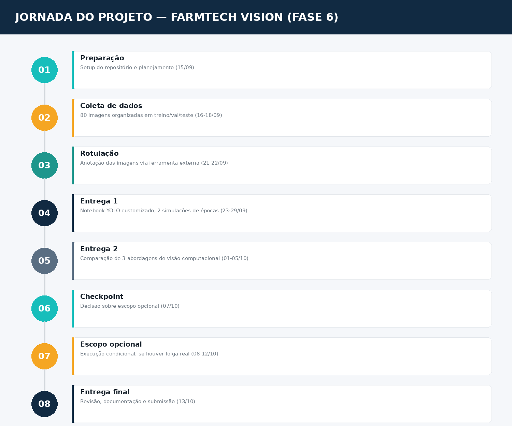

# 📅 Cronograma — FarmTech Vision (Fase 6)

> **FIAP Challenge — Fase 6** · Período: 15/09/2026 – 13/10/2026 (21 dias úteis)

---

## Tarefas

| Código | Tarefa | Responsável | Início | Fim | Prioridade | Status |
|:------:|--------|:-----------:|:------:|:---:|:----------:|:------:|
| F6-01 | Setup do repositório `grupo-3-farmtech-fase6` | Gerson | 15/09 | 15/09 | Alta | ✅ Concluída |
| F6-02 | Coletar e organizar 80 imagens (tomate/pimentão) em pastas treino/val/teste | Carlos | 16/09 | 18/09 | Crítica | 🔲 Pendente |
| F6-03 | Rotular imagens de treino via Make Sense IA (com backup LabelImg/Roboflow) | Ryann | 21/09 | 22/09 | Alta | 🔲 Pendente |
| F6-04 | Desenvolver notebook Entrega 1 (YOLO customizado, 2 simulações de épocas) | Gerson | 23/09 | 28/09 | Crítica | 🔲 Pendente |
| F6-05 | Gravar vídeo Entrega 1 e finalizar README | Ryann | 29/09 | 29/09 | Alta | 🔲 Pendente |
| F6-06 | Checkpoint de decisão — avaliar folga real antes de investir em escopo opcional | Gerson | 07/10 | 07/10 | Alta | 🔲 Pendente |
| F6-07 | Desenvolver notebook Entrega 2 (YOLO tradicional + CNN do zero + comparação) | Carlos | 01/10 | 05/10 | Crítica | 🔲 Pendente |
| F6-08 | *Escopo opcional 1* — ESP32-CAM/webcam reconhecendo objetos em tempo real | Lucas | 08/10 | 09/10 | Média (opcional) | 🔲 Pendente |
| F6-09 | *Escopo opcional 2* — Transfer Learning + segmentação | Ryann | 08/10 | 12/10 | Média (opcional) | 🔲 Pendente |
| F6-10 | QA final — testar links, revisar README, congelar commits, submeter | Gerson | 13/10 | 13/10 | Crítica | 🔲 Pendente |

> **Nota sobre datas:** F6-08 e F6-09 rodam em paralelo (responsáveis distintos: Lucas e Ryann) após o checkpoint F6-06, condicionadas à confirmação de que há folga real no cronograma — caso não haja, ambas podem ser descartadas sem penalidade (não valem nota de boletim).

---

## Entregáveis formais

| Código | Entregável | Prazo | Responsável |
|:------:|-----------|:-----:|:-----------:|
| E01 | Repositório GitHub público, estrutura organizada | 15/09 | Gerson |
| E02 | Dataset de 80 imagens organizado (treino/val/teste) | 18/09 | Carlos |
| E03 | Rotulações exportadas (formato YOLO) | 22/09 | Ryann |
| E04 | Notebook Entrega 1 (YOLO customizado, 2 simulações) | 28/09 | Gerson |
| E05 | Vídeo + README da Entrega 1 | 29/09 | Ryann |
| E06 | Notebook Entrega 2 (comparação de 3 abordagens) | 05/10 | Carlos |
| E07 | *(condicional)* Escopo opcional 1 — sistema ESP32-CAM/webcam | 09/10 | Lucas |
| E08 | *(condicional)* Escopo opcional 2 — Transfer Learning + segmentação | 12/10 | Ryann |
| E09 | README final consolidado + link do vídeo | 13/10 | Gerson |

---

## Marcos principais

| Marco | Data | Observação |
|-------|:----:|------------|
| Início do projeto | 15/09/2026 | Setup do repositório concluído |
| Dataset pronto | 18/09/2026 | Fim da coleta de imagens |
| Rotulação concluída | 22/09/2026 | Pronto para treino |
| Entrega 1 completa | 29/09/2026 | Notebook + vídeo + README parcial |
| Checkpoint de decisão | 07/10/2026 | Go/no-go para o escopo opcional |
| Entrega 2 completa | 05/10/2026 | Comparação das 3 abordagens |
| **Entrega final** | **13/10/2026** | Prazo improrrogável — nenhum commit após esta data |

---

## Observações

- Cronograma respeita apenas dias úteis (segunda a sexta) — fins de semana ficam como folga estratégica.
- Equipe efetiva de 3 membros (Gerson, Carlos, Ryann) para o caminho crítico — Lucas participa formalmente da equipe, alocado apenas em F6-08 (tarefa opcional, sem carga em nenhuma task obrigatória), por questão pessoal registrada.
