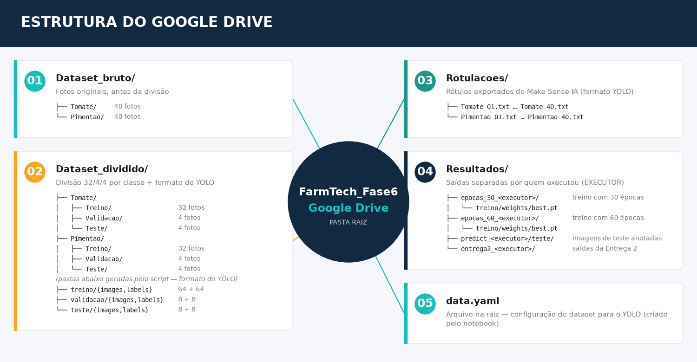

# Estrutura de Pastas — Google Drive (Fase 6)



> ⚠️ **Os nomes abaixo são os nomes reais das pastas no Drive, com maiúsculas e minúsculas exatas.** O Google Colab diferencia maiúsculas de minúsculas: `Dataset_dividido` e `dataset_dividido` são pastas diferentes para ele. O notebook usa exatamente estes nomes.

## Onde fica a pasta e como acessá-la no Colab

A pasta `FarmTech_Fase6` fica no **Meu Drive** do Gerson e é compartilhada com o grupo como Editor (não é um "Drive compartilhado"). No Colab, o caminho usado pelo notebook é:

```
/content/drive/MyDrive/FarmTech_Fase6
```

- **Para o dono da pasta:** funciona direto.
- **Para os demais membros:** a pasta aparece em "Compartilhados comigo", que o Colab não enxerga em `MyDrive`. Faça uma única vez: no Google Drive, clique com o botão direito em `FarmTech_Fase6` → **Organizar** → **Adicionar atalho** → **Meu Drive**. Com o atalho na raiz do Meu Drive, o mesmo caminho acima passa a funcionar.

## Estrutura

```
FarmTech_Fase6/
├── Dataset_bruto/
│   ├── Tomate/          ← as 40 fotos de tomate, antes de qualquer divisão
│   └── Pimentao/        ← as 40 fotos de pimentão, antes de qualquer divisão
│
├── Dataset_dividido/
│   ├── Tomate/
│   │   ├── Treino/      ← 32 imagens
│   │   ├── Validacao/   ← 4 imagens
│   │   └── Teste/       ← 4 imagens
│   ├── Pimentao/
│   │   ├── Treino/      ← 32 imagens
│   │   ├── Validacao/   ← 4 imagens
│   │   └── Teste/       ← 4 imagens
│   │
│   │   (pastas abaixo GERADAS pelo script — ver seção "Formato do YOLO")
│   ├── treino/
│   │   ├── images/      ← 64 imagens (32 tomate + 32 pimentão)
│   │   └── labels/      ← 64 rótulos .txt
│   ├── validacao/
│   │   ├── images/      ← 8 imagens
│   │   └── labels/
│   └── teste/
│       ├── images/      ← 8 imagens
│       └── labels/
│
├── Rotulacoes/
│   └── (arquivos exportados do Make Sense IA em formato YOLO —
│        um .txt por imagem, com o mesmo nome: "Tomate 16.jpg" → "Tomate 16.txt")
│
├── Resultados/
│   ├── epocas_30_<executor>/   ← treino com 30 épocas de cada integrante (criada pelo treino)
│   │   └── treino/weights/best.pt
│   ├── epocas_60_<executor>/   ← treino com 60 épocas de cada integrante (criada pelo treino)
│   │   └── treino/weights/best.pt
│   ├── predict_<executor>/     ← imagens de teste com as detecções (criada pela seção 7)
│   │   └── teste/
│   └── entrega2_<executor>/    ← saídas do notebook da Entrega 2
│       ├── cnn_do_zero.keras   ← CNN treinada (recarregar: keras.models.load_model)
│       ├── comparacao.csv      ← tabela comparativa das 3 abordagens
│       ├── val_teste_yolo_customizada/, predict_yolo_*/   ← métricas e imagens anotadas
│       └── data.yaml           ← cópia usada para avaliar a YOLO no conjunto de teste
│
└── data.yaml            ← criado pelo notebook (seção 2.3)
```

Nome das fotos: `Tomate 01.jpg` … `Tomate 40.jpg` e `Pimentao 01.jpg` … `Pimentao 40.jpg`.

## Por que essa estrutura

- **`Dataset_bruto/`** — mantém as fotos originais intactas, caso precise refazer a divisão treino/val/teste depois
- **`Dataset_dividido/<Classe>/<Split>/`** — divisão 32/4/4 feita por classe, fácil de conferir visualmente
- **`Rotulacoes/`** — centraliza os arquivos de anotação exportados, separados das imagens (facilita conferir se todas as imagens têm rótulo correspondente)
- **`Resultados/`** — separa as duas simulações de época (30 vs 60) pedidas no enunciado e, dentro delas, quem executou o treino, facilitando comparar depois

## Formato do YOLO (images/labels)

O YOLO não lê a divisão por classe nem a pasta `Rotulacoes/` diretamente. Ele exige, para cada split, duas pastas irmãs — `images/` e `labels/` — com as duas classes juntas e cada imagem acompanhada de um `.txt` de mesmo nome. Quem diferencia tomate de pimentão é o **índice de classe** na primeira coluna de cada `.txt`: `0` = tomate, `1` = pimentão (mesma ordem de `names` no `data.yaml`).

Essa estrutura é gerada pelo script [`scripts/organizar_dataset_yolo.py`](../scripts/organizar_dataset_yolo.py), executado pela célula 2.1 do notebook. O script:

- **copia** as imagens e os rótulos — nunca move nem apaga os originais;
- normaliza os nomes no destino (`Tomate 16.jpg` → `tomate_16.jpg`);
- grava o índice de classe a partir do nome do arquivo. Na exportação original, o índice dentro dos `.txt` não corresponde ao objeto (há rótulos de tomate com `1` e de pimentão com `0`); as coordenadas das caixas são mantidas como foram desenhadas;
- aponta rótulo faltando, linha inválida ou imagem repetida entre splits, e termina com erro nesses casos.

Pode ser executado de novo sempre que as fotos ou os rótulos mudarem. Para simular sem copiar nada:

```bash
python scripts/organizar_dataset_yolo.py --base /content/drive/MyDrive/FarmTech_Fase6 --dry-run
```

## Resultados por integrante (`EXECUTOR`)

Os quatro integrantes rodam o mesmo notebook apontando para a mesma pasta do Drive. Para não misturar resultados, a célula 1 define:

```python
EXECUTOR = 'gerson'  # cada integrante troca para o próprio primeiro nome antes de rodar
```

- **Antes de rodar, troque `EXECUTOR` pelo seu primeiro nome** (minúsculo, sem acento). Se ficar o valor padrão, o seu treino é gravado como se fosse de outra pessoa.
- Cada treino grava em uma pasta própria: `Resultados/epocas_30_<executor>/treino/` e `Resultados/epocas_60_<executor>/treino/`. O teste da seção 7 grava as imagens com as detecções em `Resultados/predict_<executor>/teste/` (reexecutar sobrescreve a mesma pasta). Assim, os resultados de cada pessoa ficam isolados e é possível saber de quem é cada modelo.
- O notebook da Entrega 2 grava tudo em `Resultados/entrega2_<executor>/` (reexecutar sobrescreve). Ele não treina o YOLO de novo: compara sempre com o modelo oficial da Entrega 1 (`epocas_60_gerson/treino-2/weights/best.pt`) e lê as fotos direto de `Dataset_dividido/{Tomate,Pimentao}/…` e `Dataset_dividido/teste/` — nenhuma imagem é copiada.
- Se a mesma pessoa treinar de novo com o mesmo número de épocas, o Ultralytics não sobrescreve: cria `treino-2/`, `treino-3/`… dentro da pasta dela. Use sempre a mais recente.

**Recarregar um modelo já treinado (sem treinar de novo).** Se o ambiente do Colab desconectar depois do treino, os pesos continuam salvos no Drive. Basta rodar a célula 1 (montar o Drive e definir `BASE_PATH`/`EXECUTOR`), instalar o Ultralytics e carregar o `best.pt`:

```python
from ultralytics import YOLO
melhor_modelo = YOLO(f'{BASE_PATH}/Resultados/epocas_60_{EXECUTOR}/treino/weights/best.pt')
```

Com o modelo carregado, dá para seguir direto para a validação (`melhor_modelo.val(data=f'{BASE_PATH}/data.yaml')`) ou para o teste da seção 7.

## Como dividir 40 em 32/4/4

Depois de ter as 40 fotos de cada classe em `Dataset_bruto/<Classe>/`, a divisão pode ser:
- Ordenar as fotos (ex: por nome de arquivo)
- Pegar as primeiras 32 → `Treino/`
- Próximas 4 → `Validacao/`
- Últimas 4 → `Teste/`

Ou, melhor ainda (evita viés de ordem): embaralhar aleatoriamente antes de dividir. A divisão atual do dataset foi feita dessa forma — por exemplo, as imagens de teste do tomate são as de número 17, 23, 29 e 37.
