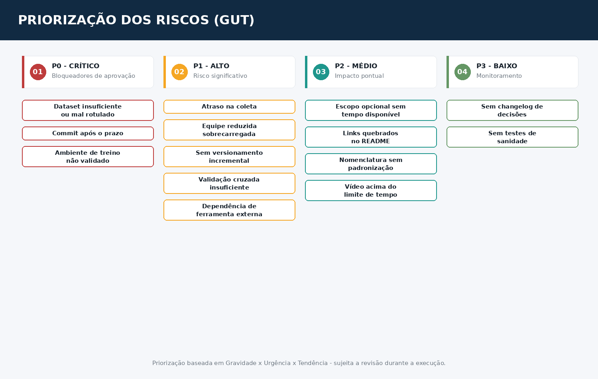

# 🎯 Matriz GUT — FarmTech Vision (Fase 6)

> Avaliação analítica do grupo (Gravidade × Urgência × Tendência), escala 1–5 para cada dimensão.
> Base: os 14 riscos de [`matriz_riscos.md`](./matriz_riscos.md).

---

## Matriz

| ID | Problema/Risco | G | U | T | GUT | Prioridade |
|:--:|-----------------|:-:|:-:|:-:|:---:|:----------:|
| P0-1 | Commit após o prazo desclassifica a entrega | 5 | 3 | 4 | **60** | 1º |
| P0-3 | Dataset insuficiente/mal rotulado | 5 | 5 | 3 | **75** | 1º |
| P0-2 | Ambiente de treino não validado | 5 | 4 | 3 | **60** | 2º |
| P1-1 | Atraso na coleta das imagens | 4 | 5 | 3 | **60** | 2º |
| P1-5 | Dependência do Make Sense IA sem contingência | 3 | 3 | 3 | **27** | 5º |
| P1-2 | Equipe reduzida sobrecarregada | 4 | 3 | 4 | **48** | 3º |
| P1-4 | Falta de validação cruzada rigorosa | 4 | 2 | 3 | **24** | 6º |
| P1-3 | Notebook sem versionamento incremental | 3 | 2 | 3 | **18** | 8º |
| P2-1 | Ir Além 2 sem tempo real disponível | 2 | 2 | 2 | **8** | 12º |
| P2-4 | Vídeo pode exceder 5 minutos | 3 | 3 | 2 | **18** | 8º |
| P2-2 | Links quebrados no README | 3 | 2 | 2 | **12** | 10º |
| P2-3 | Falta de padronização de nomenclatura | 2 | 2 | 2 | **8** | 12º |
| P3-1 | Ausência de changelog de decisões | 1 | 1 | 2 | **2** | 14º |
| P3-2 | Ausência de testes de sanidade no notebook | 2 | 1 | 2 | **4** | 13º |

---

## Leitura da matriz

Os dois riscos de maior GUT (**P0-3**, GUT 75, e os três empatados em GUT 60) confirmam o que já era esperado pela própria estrutura do cronograma: **o dataset é o gargalo real do projeto**. Sem imagens suficientes e bem rotuladas, nada mais avança — treino, comparação de abordagens, e até os "Ir Além" ficam inviabilizados.

O risco de prazo (P0-1, GUT 60) mantém prioridade alta mesmo com Urgência mais baixa (3) porque, embora só se materialize no fim do projeto, a Gravidade é máxima (desclassificação total) — por isso a mitigação (travar commits a partir de 12/10) precisa estar decidida desde já, não in extremis.

Os riscos ligados aos "Ir Além" (P2-1, P2-3) ficam nos últimos lugares da priorização — coerente com a decisão de tratá-los como opcionais, condicionados ao checkpoint de 07/10.

---

## 🔁 Retroativo

*(Seção a ser preenchida durante a execução do projeto, junto da task F6-08 ou equivalente de revisão — mesmo padrão usado nos projetos anteriores do grupo, comparando a priorização inicial com o que de fato se mostrou crítico na prática.)*
