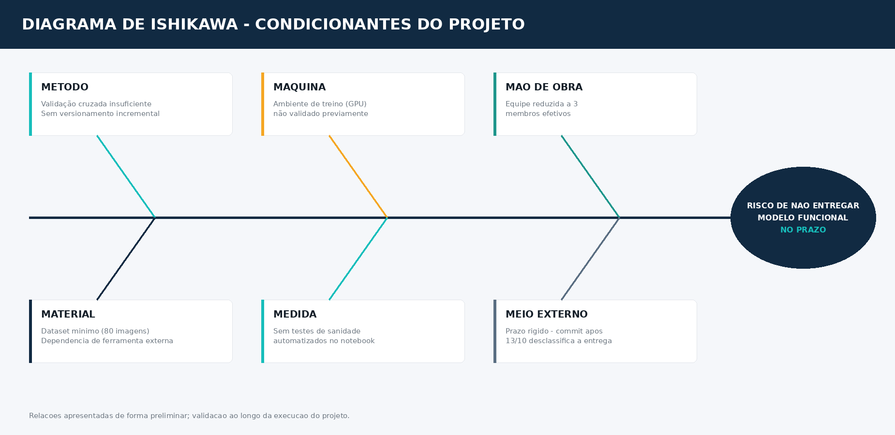

# 🐟 Diagrama de Ishikawa — FarmTech Vision (Fase 6)

> **Efeito analisado:** risco de não entregar um modelo de visão computacional funcional e bem documentado dentro do prazo (13/10/2026).
> Causas organizadas pelos 6M, derivadas dos riscos identificados em [`matriz_riscos.md`](./matriz_riscos.md).

---

## Causas por categoria (6M)

| Categoria | Causa raiz | Risco associado | Responsável |
|-----------|-----------|:----------------:|:-----------:|
| **Método** | Ausência de processo formal de validação cruzada treino/val/teste antes de reportar métricas | P1-4 | Gerson |
| **Método** | Falta de disciplina de commits incrementais durante o desenvolvimento do notebook | P1-3 | Gerson |
| **Máquina** | Ambiente de treino (runtime GPU do Colab) não testado/validado antes do início real do treino | P0-2 | Gerson |
| **Material** | Dataset de apenas 80 imagens (mínimo exigido) — pouca margem para erro de captura ou rotulação incorreta | P0-3 | Carlos |
| **Material** | Dependência de uma única ferramenta externa (Make Sense IA) para rotulação, sem plano B pronto | P1-5 | Carlos |
| **Material** | Coleta das imagens é etapa manual, sujeita a atraso por disponibilidade dos membros | P1-1 | Carlos |
| **Mão de obra** | Equipe efetivamente reduzida a 3 membros (Lucas com capacidade reduzida) frente ao escopo total (2 entregas + 2 itens opcionais) | P1-2 | Gerson |
| **Medida** | Sem testes de sanidade automatizados (shapes, tipos de dado) no notebook — erros só aparecem tarde | P3-2 | Carlos |
| **Medida** | Falta de convenção de nomenclatura definida desde o início (arquivos, pastas no Drive) | P2-3 | Ryann |
| **Meio externo** | Regra de prazo rígida da FIAP — qualquer commit após 13/10 desclassifica a entrega inteira | P0-1 | Gerson |
| **Meio externo** | Dependência de dois sistemas externos (GitHub + README) permanecerem sincronizados e sem links quebrados | P2-2 | Ryann |

---

## Leitura cruzada com a Matriz GUT

As causas mais críticas segundo o Ishikawa (**Material** — dataset insuficiente, e **Máquina** — ambiente não validado) coincidem exatamente com os riscos de maior pontuação GUT (P0-3, P0-2), confirmando que **a categoria Material é o ponto de maior atenção** no início do projeto: sem dataset e ambiente prontos, nenhuma das outras causas (Método, Mão de obra, Medida) chega a se manifestar, porque o projeto simplesmente não avança.

A causa de **Meio externo** ligada ao prazo (P0-1) é estruturalmente diferente das demais — não é um problema técnico a resolver, é uma restrição externa fixa (regra da FIAP) que exige disciplina de processo (reservar o último dia só para revisão) em vez de solução técnica.

---

## 🔁 Retroativo

*(Seção a ser preenchida durante a execução do projeto — comparar as causas previstas aqui com o que de fato gerou atraso ou retrabalho na prática.)*
