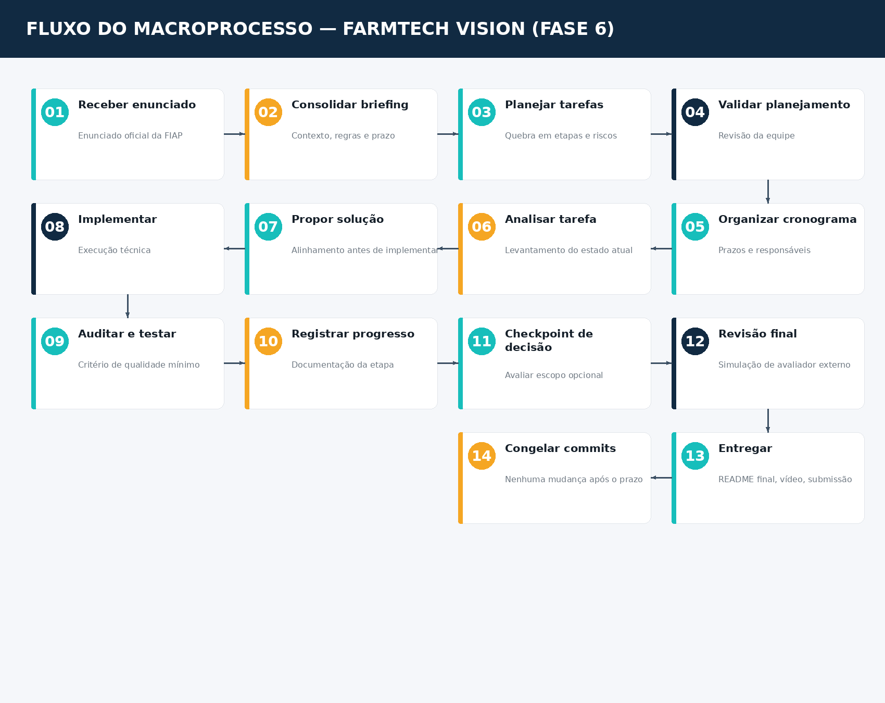

# 🔄 Fluxo do Macroprocesso — FarmTech Vision (Fase 6)

> Visão de gestão do projeto: como o trabalho flui do planejamento à entrega final, independente da tecnologia específica de cada etapa técnica (ver seção "Solução Técnica" do README para o fluxo de dados do sistema em si).

---

## As 4 macro-etapas

### 1. Planejamento
Do enunciado oficial até o cronograma final, com tarefas e riscos mapeados e validados pela equipe antes de iniciar qualquer execução técnica.

### 2. Execução
Cada tarefa do cronograma passa pelo mesmo ciclo disciplinado: análise do estado atual, proposta de solução, implementação, e registro do progresso — garantindo que nenhuma implementação pule etapas de análise ou documentação, independente de quão simples a tarefa pareça.

### 3. Validação
Dois pontos de controle formais:
- **Checkpoint de decisão** — avalia se há folga real de cronograma antes de investir em trabalho opcional (Ir Além)
- **Revisão final** — simula um avaliador sem contexto nenhum, verificando se toda documentação/links/instruções realmente funcionam para quem nunca viu o projeto

### 4. Entrega
README final consolidado, vídeo gravado, e o congelamento de commits antes do prazo — nenhum trabalho técnico novo depois desse ponto, só revisão.

---

## Por que este documento existe

Diferente do cronograma (que mostra **quando** cada coisa acontece) e da arquitetura técnica (que mostra **como** o sistema funciona), este documento mostra **como o trabalho em si é conduzido** — a disciplina de processo que se repete em todo o desenvolvimento, independente do enunciado específico. Serve tanto para orientar a equipe quanto para deixar auditável, para quem revisar o projeto depois, que não houve atalho no processo.
