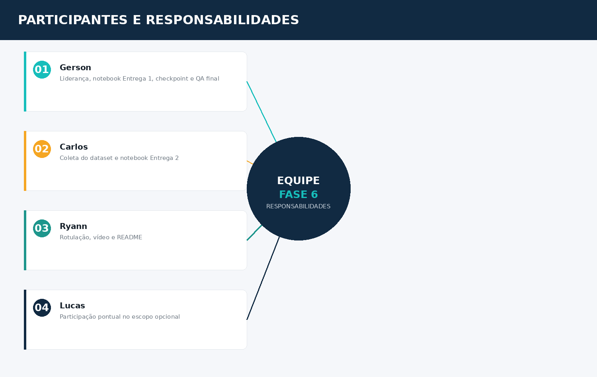

# 👥 RACI — FarmTech Vision (Fase 6)

> **FIAP Challenge — Fase 6** · Responsabilidades da equipe por atividade

---

## Legenda RACI

| Letra | Significado | Interpretação operacional |
|:-----:|--------------|----------------------------|
| **R** | Responsável | Executa ou coordena a execução da atividade |
| **A** | Aprovador/Autoridade | Responde pelo resultado e concede a aprovação final |
| **C** | Consultado | Fornece informações antes da decisão ou execução |
| **I** | Informado | Recebe comunicação sobre andamento ou resultado |

> *Nota: a acumulação dos papéis R e A no mesmo integrante é admissível para equipes pequenas — é o caso da maioria das atividades deste projeto.*

---

## Integrantes

| Sigla | Nome | RM | Papel |
|:-----:|------|:--:|-------|
| GER | Gerson Ferreira da Graça | 569624 | Liderança técnica, arquitetura, QA final |
| LUC | Lucas Braga | 568712 | Integrante formal — capacidade reduzida (questão pessoal), sem carga no caminho crítico |
| CAR | Carlos Leonardo Mazieri | 572809 | Coleta de dados, comparação de modelos |
| RYA | Ryann Pinto | 571003 | Documentação, rotulação, apresentação |

---

## Frente principal por integrante

| Integrante | Frente |
|-----------|--------|
| **Gerson** | Liderança do projeto, notebook da Entrega 1 (YOLO customizado), checkpoint de decisão, QA final e submissão |
| **Carlos** | Coleta e organização do dataset, notebook da Entrega 2 (comparação de abordagens) |
| **Ryann** | Rotulação das imagens, vídeo e README da Entrega 1 |
| **Lucas** | Participação pontual no escopo opcional, conforme disponibilidade — sem dependência do caminho crítico |

---

## Matriz — Atividade × Responsabilidade (RACI)

| Atividade (código) | GER | LUC | CAR | RYA |
|---------------------|:---:|:---:|:---:|:---:|
| F6-01 — Setup do repositório | A/R | — | — | — |
| F6-02 — Coleta e organização das 80 imagens | C | — | A/R | — |
| F6-03 — Rotulação das imagens | C | — | — | A/R |
| F6-04 — Notebook Entrega 1 (YOLO customizado) | A/R | — | C | — |
| F6-05 — Vídeo + README Entrega 1 | C | — | — | A/R |
| F6-06 — Checkpoint de decisão | A/R | — | C | C |
| F6-07 — Notebook Entrega 2 (comparação) | C | — | A/R | — |
| F6-08 — Escopo opcional 1 | I | A/R | — | — |
| F6-09 — Escopo opcional 2 | I | — | — | A/R |
| F6-10 — QA final e submissão | A/R | — | C | C |

---

## Observações

- **Sobrecarga do Gerson:** concentra A/R em 4 das 10 atividades (F6-01, F6-04, F6-06, F6-10), incluindo o checkpoint de decisão e a QA final — ambas exigem visão de conjunto do projeto. Risco monitorado; se necessário, Carlos ou Ryann podem assumir parte da revisão em F6-10.
- **Lucas:** integrante formal do grupo, mantido no RACI por transparência e reconhecimento do trabalho em fases anteriores (Fase 5). Alocado apenas em atividade opcional (sem impacto em nota de boletim), sem dependência no caminho crítico do projeto.
- Nenhuma atividade obrigatória (Entregas 1 e 2) depende exclusivamente de uma única pessoa sem consulta de pelo menos mais um integrante — reduz risco de bloqueio por ausência pontual.
