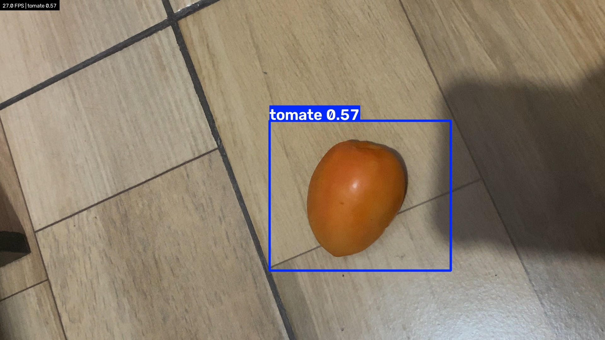

# Ir Além 1 — Detecção de tomate e pimentão em tempo real

> **FIAP — Fase 6 · Escopo opcional 1** · Reconhecimento em tempo real usando o modelo `best.pt` da Entrega 1

## 🎯 Objetivo

Levar o modelo treinado na Entrega 1 (YOLO customizado, 60 épocas, mAP50 = 0,916 na validação) para fora do notebook: capturar imagens de uma câmera **ao vivo** e reconhecer tomate e pimentão em cada quadro, mostrando na tela a caixa, a classe e a confiança de cada detecção.

## 📷 Por que webcam, e não ESP32-CAM

O enunciado propõe uma ESP32-CAM **ou** uma webcam. O grupo não tem uma ESP32-CAM física disponível, então a captura é feita pela webcam do computador. A arquitetura é a mesma nos dois casos — só muda a origem da imagem:

| Etapa | Com ESP32-CAM | Com webcam (este projeto) |
|-------|---------------|---------------------------|
| Captura | Câmera da placa, enviada por Wi-Fi como stream de vídeo | Câmera do computador (USB ou integrada) |
| Leitura dos quadros | `cv2.VideoCapture('http://<ip-da-placa>:81/stream')` | `cv2.VideoCapture(n)` — `n` é a câmera encontrada (ou escolhida, se houver mais de uma) |
| Inferência | `best.pt` da Entrega 1, rodando no computador | Igual |
| Saída | Caixas, classe e confiança na tela + prints | Igual |

Nos dois casos a placa ou a webcam apenas **captura**; a inferência roda no computador, porque a ESP32-CAM não tem capacidade para executar o YOLO. Por isso o script já aceita uma URL de stream no lugar do índice da webcam (`--fonte`): se uma ESP32-CAM ficar disponível, basta carregar nela o exemplo *CameraWebServer* da Arduino IDE e apontar o script para o endereço do stream. Essa variante **não foi testada**, por falta da placa.

## 🧱 Fluxo

```
câmera ──► quadro (OpenCV) ──► YOLO customizado (best.pt) ──► caixas + classe + confiança ──► janela na tela
                                                                                          └──► tecla "s" → print em prints/
```

## 📦 Requisitos

- Um computador com **macOS** ou **Windows**, com internet e cerca de **3 GB livres** no disco.
- **Python 3.12 ou 3.13** — o passo a passo abaixo mostra como conferir e, se precisar, instalar.
- Uma **webcam** (a do notebook serve). Sem webcam, dá para usar um arquivo de vídeo — ver a seção **Sem webcam própria**, mais abaixo.
- **Acesso à pasta do projeto no Google Drive** (`FarmTech_Fase6`), de onde vem o modelo treinado (`best.pt`).
- Tempo: uns **30 minutos na primeira vez** (a maior parte é download e instalação); nas próximas, menos de 1 minuto.

## ▶️ Como Executar

Siga **só a receita do seu sistema** — 🍎 [macOS](#macos) ou 🪟 [Windows](#windows) — de cima para baixo, sem pular passos. Cada passo diz em que pasta você precisa estar, como conferir e o que deve aparecer na tela.

**Três ideias que valem para a receita inteira:**

- **O terminal** é uma janela onde você digita comandos de texto. Para rodar um comando: copie a linha do bloco cinza, cole no terminal e aperte **Enter**. Rode **uma linha por vez** e espere terminar (a linha de digitação volta a aparecer) antes da próxima.
- **O terminal sempre "está" dentro de alguma pasta** — como uma janela do Finder ou do Explorador de Arquivos aberta em um lugar. Os comandos procuram os arquivos **a partir dessa pasta**. Por isso, antes dos comandos importantes, a receita manda conferir onde você está.
- Onde aparecer **`seunome`**, no seu computador vai aparecer o **nome do seu usuário** (por exemplo, `/Users/maria` ou `C:\Users\maria`). É normal.

<a id="macos"></a>

### 🍎 Receita para macOS

#### Passo 1 — Abrir o Terminal

Aperte **Command (⌘) + Espaço**, digite **Terminal** e aperte **Enter**. Abre uma janela com uma linha terminando em `%` — é ali que você digita.

Confira onde o Terminal está. Digite o comando abaixo e aperte Enter (`pwd` mostra a pasta atual):

```bash
pwd
```

Deve aparecer a sua **pasta pessoal**:

```
/Users/seunome
```

Se aparecer outra coisa, digite `cd ~` e aperte Enter (`cd ~` leva o Terminal de volta à pasta pessoal) e rode `pwd` de novo.

#### Passo 2 — Conferir se o Python está instalado

```bash
python3 --version
```

Este comando só mostra a versão do Python instalada. **Deu certo** se aparecer `Python 3.12.` ou `Python 3.13.` seguido de um número (por exemplo, `Python 3.13.12`).

**Se aparecer uma versão menor** (como `Python 3.9.6`), `command not found`, ou uma janela pedindo para instalar "ferramentas de desenvolvedor":

1. Feche a janela que tiver aberto (se houver) e entre em [python.org/downloads](https://www.python.org/downloads/).
2. Baixe o instalador para macOS da versão **3.13** e instale (é só ir clicando em **Continuar**).
3. **Feche o Terminal e abra de novo** (passo 1) — o Terminal só enxerga o Python novo depois de reaberto.
4. Rode `python3 --version` outra vez.

#### Passo 3 — Baixar o projeto para a sua pasta pessoal

**Neste momento você deve estar na sua pasta pessoal.** Confira com `pwd` — deve aparecer `/Users/seunome`. Se não, rode `cd ~`.

Escolha **uma** das duas formas:

**Forma A — com o git** (se `git --version` mostrar algo como `git version 2.39.5`):

```bash
git clone https://github.com/Graca-Gerson/grupo-3-farmtech-fase6.git
```

Este comando baixa o projeto inteiro numa pasta nova chamada `grupo-3-farmtech-fase6`, dentro da pasta onde você está. Deu certo se a última linha disser `Resolving deltas: 100%` (ou simplesmente voltar o `%` sem erro).

**Forma B — sem o git** (se `git --version` der erro ou abrir uma janela pedindo instalação — nesse caso, clique em **Cancelar**):

1. Abra [github.com/Graca-Gerson/grupo-3-farmtech-fase6](https://github.com/Graca-Gerson/grupo-3-farmtech-fase6) no navegador, clique no botão verde **Code** e depois em **Download ZIP**.
2. Na pasta **Downloads**, dê dois cliques no arquivo `grupo-3-farmtech-fase6-main.zip`. Aparece uma pasta `grupo-3-farmtech-fase6-main`.
3. Renomeie essa pasta para **`grupo-3-farmtech-fase6`** (sem o `-main`).
4. Mova a pasta para a sua **pasta pessoal**: no Finder, menu **Ir → Pessoal** (ou ⌘ + Shift + H) abre a pasta pessoal; arraste a pasta para lá.

**Conferência (vale para A e B):**

```bash
ls
```

`ls` lista o que existe na pasta atual. Na lista deve aparecer **`grupo-3-farmtech-fase6`**. Se não aparecer, a pasta não está na sua pasta pessoal — refaça a Forma B, item 4.

#### Passo 4 — Entrar na pasta do projeto

**Neste momento você deve estar na sua pasta pessoal** (`pwd` → `/Users/seunome`).

```bash
cd grupo-3-farmtech-fase6
```

`cd` ("change directory") faz o Terminal entrar na pasta indicada. Confira:

```bash
pwd
```

Deve aparecer:

```
/Users/seunome/grupo-3-farmtech-fase6
```

E `ls` deve listar, entre outros, `README.md`, `requirements.txt` e `ir_alem`. Se aparecer `no such file or directory`, você não estava na pasta pessoal ou a pasta tem outro nome — rode `cd ~` e volte ao passo 3 (conferência).

#### Passo 5 — Criar o ambiente virtual (só na primeira vez)

**Neste momento você deve estar em `/Users/seunome/grupo-3-farmtech-fase6`** (confira com `pwd`).

```bash
python3 -m venv .venv
```

Este comando cria uma "caixa" chamada `.venv`, dentro do projeto, onde as bibliotecas vão ser instaladas sem misturar com o resto do computador. Leva alguns segundos e **não mostra nada** quando dá certo — só volta o `%`.

Confira com `ls -a` (lista também os itens ocultos, que começam com ponto): deve aparecer **`.venv`**.

#### Passo 6 — Ativar o ambiente virtual (toda vez que abrir um Terminal novo)

**Neste momento você deve estar em `/Users/seunome/grupo-3-farmtech-fase6`** (confira com `pwd`).

```bash
source .venv/bin/activate
```

Este comando "liga" a caixa criada no passo 5. **Deu certo** se o começo da linha de digitação passar a mostrar **`(.venv)`**, assim:

```
(.venv) seunome@MacBook grupo-3-farmtech-fase6 %
```

Se aparecer `no such file or directory`, você não está na pasta do projeto (volte ao passo 4) ou pulou o passo 5.

> ⚠️ Fechou o Terminal? Ao abrir de novo, ele volta para a pasta pessoal e **sem** o `(.venv)`. Repita o passo 4 (`cd grupo-3-farmtech-fase6`) e este passo 6.

#### Passo 7 — Instalar as bibliotecas (só na primeira vez)

**Neste momento você deve estar em `/Users/seunome/grupo-3-farmtech-fase6`, com `(.venv)` no começo da linha.**

```bash
pip install -r requirements.txt
```

Este comando baixa e instala todas as bibliotecas que o projeto usa (lista no arquivo `requirements.txt`). **Demora vários minutos** e baixa cerca de 1–2 GB; o texto rola bastante — é normal. **Deu certo** se a última linha começar com `Successfully installed` e não houver nenhuma linha com `ERROR`.

Se aparecer `ERROR` falando de versão do Python (`Requires-Python`), o seu Python é antigo — volte ao passo 2.

#### Passo 8 — Colocar o modelo treinado (`best.pt`) no lugar certo (só na primeira vez)

O modelo não vem junto com o projeto: ele fica no Google Drive.

1. No navegador, abra o [Google Drive](https://drive.google.com) com a conta que tem acesso ao projeto. Abra a pasta `FarmTech_Fase6` (em **Meu Drive** ou em **Compartilhados comigo**) e entre em `Resultados` → `epocas_60_gerson` → `treino-2` → `weights`.
2. Clique com o botão direito em **`best.pt`** → **Fazer download**. O arquivo (cerca de 6 MB) vai para a pasta **Downloads**.

Agora, no Terminal. **Neste momento você deve estar em `/Users/seunome/grupo-3-farmtech-fase6`** (confira com `pwd`).

```bash
mkdir -p ir_alem/ir_alem_1_deteccao_tempo_real/modelo
```

Cria a pasta `modelo`, onde o programa procura o arquivo. Não mostra nada quando dá certo.

```bash
mv ~/Downloads/best.pt ir_alem/ir_alem_1_deteccao_tempo_real/modelo/best.pt
```

Move o arquivo da pasta Downloads para a pasta `modelo`. Não mostra nada quando dá certo. Confira:

```bash
ls ir_alem/ir_alem_1_deteccao_tempo_real/modelo
```

Deve aparecer **`best.pt`**. Se o comando `mv` disser `No such file or directory`, o arquivo na pasta Downloads tem outro nome (o navegador chama de `best (1).pt` quando já existe um `best.pt`): renomeie o arquivo para `best.pt` no Finder e rode o `mv` de novo.

#### Passo 9 — Liberar a câmera para o Terminal (só na primeira vez)

Clique no **ícone da maçã**, no canto superior esquerdo da tela, e abra **Ajustes do Sistema → Privacidade e Segurança → Câmera**. Ative a chave do **Terminal** (se o Terminal ainda não estiver na lista, ele aparece depois da primeira tentativa de abrir a câmera, no passo 11).

Se você ativou a chave agora, **feche o Terminal e abra de novo** e refaça: passo 4 (`cd grupo-3-farmtech-fase6`) e passo 6 (`source .venv/bin/activate`).

Feche também programas que possam estar usando a câmera (FaceTime, Zoom, Teams, Meet no navegador) — normalmente só um programa por vez consegue usá-la.

#### Passo 10 — Entrar na pasta do Ir Além 1

**Neste momento você deve estar em `/Users/seunome/grupo-3-farmtech-fase6`, com `(.venv)` no começo da linha** (confira com `pwd`).

```bash
cd ir_alem/ir_alem_1_deteccao_tempo_real
```

Confira:

```bash
pwd
```

Deve aparecer:

```
/Users/seunome/grupo-3-farmtech-fase6/ir_alem/ir_alem_1_deteccao_tempo_real
```

E `ls` deve listar `README.md`, `deteccao_tempo_real.py` e `modelo`. Se não, rode `cd ~/grupo-3-farmtech-fase6` e repita este passo.

#### Passo 11 — Rodar o programa

**Neste momento você deve estar em `/Users/seunome/grupo-3-farmtech-fase6/ir_alem/ir_alem_1_deteccao_tempo_real`, com `(.venv)`.**

```bash
python deteccao_tempo_real.py
```

Este comando inicia o programa. Em poucos segundos o Terminal mostra:

```
modelo: /Users/seunome/grupo-3-farmtech-fase6/ir_alem/ir_alem_1_deteccao_tempo_real/modelo/best.pt | classes: {0: 'tomate', 1: 'pimentao'}
procurando câmeras...
```

O programa procura as câmeras do computador (leva 2 ou 3 segundos):

- **Se o computador tiver só uma câmera**, ele segue sozinho — **nenhuma pergunta aparece**.
- **Se tiver mais de uma** (por exemplo, a câmera do Mac e a do iPhone ou iPad, que o macOS oferece quando estão por perto e na mesma conta Apple), aparece uma **lista de câmeras** e o programa espera você digitar um número. Veja [Se aparecer uma lista de câmeras](#se-aparecer-uma-lista-de-cameras), logo depois da receita do Windows.

Depois disso aparecem estas duas linhas (o número depois de `fonte de vídeo` é o da câmera usada):

```
fonte de vídeo: 0 | confiança mínima: 0.5
teclas: s = salvar print | q ou Esc = sair
```

e **abre uma janela com a imagem da câmera**. Na primeira vez, o macOS pode perguntar se o Terminal pode usar a câmera: clique em **Permitir**, feche o programa (tecla `q`, com a janela selecionada) e rode o comando de novo.

O Terminal fica "ocupado" enquanto o programa roda — não digite nada nele; use a janela da câmera.

#### Passo 12 — Usar o programa

Veja a seção [O que acontece na janela](#o-que-acontece-na-janela), logo depois da receita do Windows.

#### Da segunda vez em diante (atalho)

Abra o Terminal (passo 1) e rode, uma linha por vez:

```bash
cd ~/grupo-3-farmtech-fase6
source .venv/bin/activate
cd ir_alem/ir_alem_1_deteccao_tempo_real
python deteccao_tempo_real.py
```

<a id="windows"></a>

### 🪟 Receita para Windows

#### Passo 1 — Abrir o PowerShell

Clique no menu **Iniciar**, digite **PowerShell** e abra o **Windows PowerShell**. Abre uma janela azul ou preta com uma linha parecida com `PS C:\Users\seunome>` — é ali que você digita. (Use o PowerShell, **não** o "Prompt de Comando": os comandos abaixo são do PowerShell.)

Confira onde o PowerShell está. Digite o comando abaixo e aperte Enter (`Get-Location` mostra a pasta atual):

```powershell
Get-Location
```

Deve aparecer a sua **pasta pessoal**:

```
Path
----
C:\Users\seunome
```

Se aparecer outra coisa, digite `cd ~` e aperte Enter (`cd ~` leva o PowerShell de volta à pasta pessoal) e rode `Get-Location` de novo.

#### Passo 2 — Conferir se o Python está instalado

```powershell
py --version
```

Este comando só mostra a versão do Python instalada. **Deu certo** se aparecer `Python 3.12.` ou `Python 3.13.` seguido de um número (por exemplo, `Python 3.13.7`).

**Se aparecer uma versão menor** ou um erro em vermelho dizendo que `py` **não é reconhecido**:

1. Entre em [python.org/downloads](https://www.python.org/downloads/), baixe o instalador para Windows da versão **3.13** e abra.
2. Na **primeira tela** do instalador, marque a caixa **"Add python.exe to PATH"** e clique em **Install Now**.
3. **Feche o PowerShell e abra de novo** (passo 1) — ele só enxerga o Python novo depois de reaberto.
4. Rode `py --version` outra vez.

#### Passo 3 — Baixar o projeto para a sua pasta pessoal

**Neste momento você deve estar na sua pasta pessoal.** Confira com `Get-Location` — deve aparecer `C:\Users\seunome`. Se não, rode `cd ~`.

Escolha **uma** das duas formas:

**Forma A — com o git** (se `git --version` mostrar algo como `git version 2.47.1.windows.1`):

```powershell
git clone https://github.com/Graca-Gerson/grupo-3-farmtech-fase6.git
```

Este comando baixa o projeto inteiro numa pasta nova chamada `grupo-3-farmtech-fase6`, dentro da pasta onde você está. Deu certo se terminar sem mensagens de erro em vermelho.

**Forma B — sem o git** (se `git --version` der erro em vermelho):

1. Abra [github.com/Graca-Gerson/grupo-3-farmtech-fase6](https://github.com/Graca-Gerson/grupo-3-farmtech-fase6) no navegador, clique no botão verde **Code** e depois em **Download ZIP**.
2. Na pasta **Downloads**, clique com o botão direito em `grupo-3-farmtech-fase6-main.zip` → **Extrair tudo** → **Extrair**.
3. O Windows cria uma pasta `grupo-3-farmtech-fase6-main` e, **dentro dela, outra com o mesmo nome**. A pasta certa é a **de dentro** — a que contém `README.md` e `requirements.txt`.
4. Renomeie essa pasta de dentro para **`grupo-3-farmtech-fase6`** (sem o `-main`).
5. Mova-a para a sua **pasta pessoal**: no Explorador de Arquivos, digite `%USERPROFILE%` na barra de endereço e aperte Enter — essa é a pasta pessoal; arraste a pasta para lá.

**Conferência (vale para A e B):**

```powershell
ls
```

`ls` lista o que existe na pasta atual. Na coluna **Name** deve aparecer **`grupo-3-farmtech-fase6`**. Se não aparecer, a pasta não está na sua pasta pessoal — refaça a Forma B, itens 3 a 5.

#### Passo 4 — Entrar na pasta do projeto

**Neste momento você deve estar na sua pasta pessoal** (`Get-Location` → `C:\Users\seunome`).

```powershell
cd grupo-3-farmtech-fase6
```

`cd` ("change directory") faz o PowerShell entrar na pasta indicada. Confira:

```powershell
Get-Location
```

Deve aparecer:

```
Path
----
C:\Users\seunome\grupo-3-farmtech-fase6
```

E `ls` deve listar, entre outros, `README.md`, `requirements.txt` e `ir_alem`. Se aparecer um erro em vermelho dizendo que o caminho não existe, você não estava na pasta pessoal ou a pasta tem outro nome — rode `cd ~` e volte ao passo 3 (conferência).

#### Passo 5 — Criar o ambiente virtual (só na primeira vez)

**Neste momento você deve estar em `C:\Users\seunome\grupo-3-farmtech-fase6`** (confira com `Get-Location`).

```powershell
py -m venv .venv
```

Este comando cria uma "caixa" chamada `.venv`, dentro do projeto, onde as bibliotecas vão ser instaladas sem misturar com o resto do computador. Leva alguns segundos e **não mostra nada** quando dá certo — só volta a linha `PS ...>`.

Confira com `ls`: na coluna **Name** deve aparecer **`.venv`**.

#### Passo 6 — Ativar o ambiente virtual (toda vez que abrir um PowerShell novo)

**Neste momento você deve estar em `C:\Users\seunome\grupo-3-farmtech-fase6`** (confira com `Get-Location`).

```powershell
.venv\Scripts\Activate.ps1
```

Este comando "liga" a caixa criada no passo 5. **Deu certo** se o começo da linha passar a mostrar **`(.venv)`**, assim:

```
(.venv) PS C:\Users\seunome\grupo-3-farmtech-fase6>
```

**Se aparecer um erro em vermelho dizendo que a execução de scripts foi desabilitada neste sistema**, rode o comando abaixo (ele libera scripts **só nesta janela** do PowerShell) e repita a ativação:

```powershell
Set-ExecutionPolicy -Scope Process -ExecutionPolicy Bypass
```

Se o erro disser que o caminho não foi encontrado, você não está na pasta do projeto (volte ao passo 4) ou pulou o passo 5.

> ⚠️ Fechou o PowerShell? Ao abrir de novo, ele volta para a pasta pessoal e **sem** o `(.venv)`. Repita o passo 4 (`cd grupo-3-farmtech-fase6`) e este passo 6.

#### Passo 7 — Instalar as bibliotecas (só na primeira vez)

**Neste momento você deve estar em `C:\Users\seunome\grupo-3-farmtech-fase6`, com `(.venv)` no começo da linha.**

```powershell
pip install -r requirements.txt
```

Este comando baixa e instala todas as bibliotecas que o projeto usa (lista no arquivo `requirements.txt`). **Demora vários minutos** e baixa cerca de 1–2 GB; o texto rola bastante — é normal. **Deu certo** se a última linha começar com `Successfully installed` e não houver nenhuma linha com `ERROR`.

Se aparecer `ERROR` falando de versão do Python (`Requires-Python`), o seu Python é antigo — volte ao passo 2.

> 💡 Computador com placa de vídeo **NVIDIA**? O programa funciona sem fazer nada a mais (usando o processador). Para usar a placa de vídeo, siga a ordem de instalação da seção "Execução local" do [README principal](../../README.md#4-execução-local-opcional--alternativa-ao-colab).

#### Passo 8 — Colocar o modelo treinado (`best.pt`) no lugar certo (só na primeira vez)

O modelo não vem junto com o projeto: ele fica no Google Drive.

1. No navegador, abra o [Google Drive](https://drive.google.com) com a conta que tem acesso ao projeto. Abra a pasta `FarmTech_Fase6` (em **Meu Drive** ou em **Compartilhados comigo**) e entre em `Resultados` → `epocas_60_gerson` → `treino-2` → `weights`.
2. Clique com o botão direito em **`best.pt`** → **Fazer download**. O arquivo (cerca de 6 MB) vai para a pasta **Downloads**.

Agora, no PowerShell. **Neste momento você deve estar em `C:\Users\seunome\grupo-3-farmtech-fase6`** (confira com `Get-Location`).

```powershell
New-Item -ItemType Directory -Force ir_alem\ir_alem_1_deteccao_tempo_real\modelo
```

Cria a pasta `modelo`, onde o programa procura o arquivo. Mostra uma pequena tabela com o nome `modelo` — é normal.

```powershell
Move-Item "$HOME\Downloads\best.pt" ir_alem\ir_alem_1_deteccao_tempo_real\modelo\best.pt
```

Move o arquivo da pasta Downloads para a pasta `modelo`. Não mostra nada quando dá certo. Confira:

```powershell
ls ir_alem\ir_alem_1_deteccao_tempo_real\modelo
```

Na coluna **Name** deve aparecer **`best.pt`**. Se o `Move-Item` der erro dizendo que não encontrou o arquivo, ele tem outro nome na pasta Downloads (o navegador chama de `best (1).pt` quando já existe um `best.pt`): renomeie para `best.pt` no Explorador de Arquivos e rode o `Move-Item` de novo.

#### Passo 9 — Liberar a câmera (só na primeira vez)

Abra **Configurações → Privacidade e segurança → Câmera** (no Windows 10: **Configurações → Privacidade → Câmera**) e deixe **ativadas** as opções **Acesso à câmera** e **Permitir que aplicativos da área de trabalho acessem sua câmera**.

Feche também programas que possam estar usando a câmera (Teams, Zoom, Skype, Meet no navegador) — normalmente só um programa por vez consegue usá-la.

#### Passo 10 — Entrar na pasta do Ir Além 1

**Neste momento você deve estar em `C:\Users\seunome\grupo-3-farmtech-fase6`, com `(.venv)` no começo da linha** (confira com `Get-Location`).

```powershell
cd ir_alem\ir_alem_1_deteccao_tempo_real
```

Confira:

```powershell
Get-Location
```

Deve aparecer:

```
Path
----
C:\Users\seunome\grupo-3-farmtech-fase6\ir_alem\ir_alem_1_deteccao_tempo_real
```

E `ls` deve listar `README.md`, `deteccao_tempo_real.py` e `modelo`. Se não, rode `cd ~\grupo-3-farmtech-fase6` e repita este passo.

#### Passo 11 — Rodar o programa

**Neste momento você deve estar em `C:\Users\seunome\grupo-3-farmtech-fase6\ir_alem\ir_alem_1_deteccao_tempo_real`, com `(.venv)`.**

```powershell
python deteccao_tempo_real.py
```

Este comando inicia o programa. Em alguns segundos o PowerShell mostra:

```
modelo: C:\Users\seunome\grupo-3-farmtech-fase6\ir_alem\ir_alem_1_deteccao_tempo_real\modelo\best.pt | classes: {0: 'tomate', 1: 'pimentao'}
procurando câmeras...
```

O programa procura as câmeras do computador (leva alguns segundos):

- **Se o computador tiver só uma câmera** (o caso mais comum), ele segue sozinho — **nenhuma pergunta aparece**.
- **Se tiver mais de uma** (por exemplo, a câmera do notebook e uma webcam USB), aparece uma **lista de câmeras** e o programa espera você digitar um número. Veja [Se aparecer uma lista de câmeras](#se-aparecer-uma-lista-de-cameras), logo abaixo.

Depois disso aparecem estas duas linhas (o número depois de `fonte de vídeo` é o da câmera usada):

```
fonte de vídeo: 0 | confiança mínima: 0.5
teclas: s = salvar print | q ou Esc = sair
```

e **abre uma janela com a imagem da câmera** (às vezes ela abre atrás do PowerShell — procure na barra de tarefas).

O PowerShell fica "ocupado" enquanto o programa roda — não digite nada nele; use a janela da câmera.

#### Passo 12 — Usar o programa

Veja a seção [O que acontece na janela](#o-que-acontece-na-janela), logo abaixo.

#### Da segunda vez em diante (atalho)

Abra o PowerShell (passo 1) e rode, uma linha por vez:

```powershell
cd ~\grupo-3-farmtech-fase6
.venv\Scripts\Activate.ps1
cd ir_alem\ir_alem_1_deteccao_tempo_real
python deteccao_tempo_real.py
```

(Se a ativação der o erro de "execução de scripts desabilitada", rode antes o `Set-ExecutionPolicy` do passo 6.)

<a id="se-aparecer-uma-lista-de-cameras"></a>

### 📷 Se aparecer uma lista de câmeras (macOS e Windows)

Só acontece quando o computador tem **mais de uma câmera disponível**. Com uma câmera só, pule esta seção. A lista aparece no **Terminal/PowerShell** (não na janela), antes de a janela abrir, e é parecida com esta:

```
Foram encontradas 2 câmeras neste computador:
  [0] Dispositivo 0 — imagem de 1920x1080
  [1] Dispositivo 1 — imagem de 1280x720
  Câmeras que o sistema informa: Câmera FaceTime HD, Câmera do iPhone.
  (a ordem desses nomes pode não ser a mesma dos números acima)
  Se a imagem que abrir não for da câmera desejada, aperte q na janela e rode de novo escolhendo outro número.
Digite o número da câmera que deseja usar (0, 1) e aperte Enter:
```

Como escolher:

1. **Digite só o número** entre colchetes da câmera desejada (por exemplo, `1`) e aperte **Enter**.
2. Se digitar algo que não está na lista (uma letra, um número que não aparece, ou só Enter), o programa avisa `... não é uma opção válida` e **pergunta de novo** — é só digitar um dos números mostrados.
3. **Não sabe qual é qual?** O número de pixels ajuda: câmeras de celular costumam ter imagem maior (por exemplo, `1920x1080`) do que a câmera de notebooks mais antigos (`1280x720`). A linha "Câmeras que o sistema informa" (só no macOS) mostra os nomes, mas **não diz qual número é qual** — a ordem dos nomes pode ser diferente da dos números. Na dúvida, escolha um número: se a janela mostrar a imagem da câmera errada, aperte `q` e rode o programa de novo (passo 11) escolhendo o outro.
4. Para **não ver a lista** nas próximas vezes, rode já informando o número da câmera — por exemplo, `python deteccao_tempo_real.py --fonte 1`.

Para desistir sem abrir a câmera, aperte **Ctrl + C**.

<a id="o-que-acontece-na-janela"></a>

### 👀 O que acontece na janela (macOS e Windows)

A janela abre logo depois que o programa encontra a câmera (ou depois que você escolhe uma, se apareceu a lista).

**A classificação é automática e contínua.** Assim que a janela abre, o programa analisa **cada imagem da câmera, várias vezes por segundo, sem você apertar nada**:

- Quando reconhece um **tomate** ou um **pimentão**, desenha uma **caixa** em volta dele com o **nome** (`tomate` ou `pimentao`) e a **confiança**, de 0 a 1 — por exemplo, `tomate 0.93` quer dizer 93% de certeza.
- No **canto superior esquerdo** aparece uma faixa com a velocidade (em quadros por segundo, **FPS**) e o resumo do que está sendo detectado naquele instante — por exemplo, `8.7 FPS | tomate 0.93`. Sem nada reconhecido, aparece `nenhuma detecção`.
- Só aparecem detecções com confiança **a partir de 0.5** (50%).
- Para resultados melhores: aproxime o fruto da câmera (ocupando boa parte da imagem), use um fundo liso e boa iluminação. O modelo aprendeu com fotos tiradas de perto.

**As teclas** — antes de apertar, **clique uma vez na janela da câmera** para selecioná-la (com o Terminal/PowerShell selecionado, as teclas não fazem efeito):

| Tecla | O que faz | O que **não** faz |
|:-----:|-----------|-------------------|
| `s` | **Salva uma foto (print)** exatamente do que está na tela naquele instante, já com as caixas e os nomes desenhados | **Não** é ela que classifica — a classificação já está acontecendo o tempo todo |
| `q` ou `Esc` | **Fecha o programa** | — |

**Onde ficam os prints:** na pasta **`prints`**, dentro da pasta do Ir Além 1 (criada no primeiro print). O nome tem data e hora — por exemplo, `deteccao_20261003_153012_482913.jpg`. A cada print, o Terminal/PowerShell mostra uma linha como:

```
print salvo: .../ir_alem/ir_alem_1_deteccao_tempo_real/prints/deteccao_20261003_153012_482913.jpg (tomate 0.93)
```

**Ao fechar** (tecla `q`), a janela some e o Terminal/PowerShell mostra `quadros processados: ...` e volta a aceitar comandos. Para abrir a pasta dos prints, rode — **ainda na pasta do Ir Além 1**:

- 🍎 macOS: `open prints`
- 🪟 Windows: `explorer prints`

### 🆘 Se algo der errado

| O que aparece na tela | O que significa | O que fazer |
|-----------------------|-----------------|-------------|
| `can't open file '...deteccao_tempo_real.py': [Errno 2] No such file or directory` | O terminal está na **pasta errada**: o programa não está onde ele procurou | Faça o passo 10 (entrar na pasta do Ir Além 1), confira com `pwd` / `Get-Location` e rode de novo |
| `ERRO: modelo não encontrado em "..."` | O arquivo `best.pt` não está na pasta `modelo` | Refaça o passo 8 e confira se o nome é exatamente `best.pt` |
| `ModuleNotFoundError: No module named 'cv2'` (ou `'ultralytics'`) | O ambiente virtual não está ligado (falta o `(.venv)` no começo da linha) ou as bibliotecas não foram instaladas | Volte à pasta do projeto (passo 4), faça o passo 6 e, se o `(.venv)` já estava lá, o passo 7 |
| 🍎 `command not found: python` | Mesmo caso acima: fora do ambiente virtual, o macOS só conhece `python3` | Faça os passos 4 e 6 e rode de novo |
| 🪟 `py`/`python` **não é reconhecido** | O Python não está instalado ou não foi adicionado ao PATH | Refaça o passo 2 (marcando **"Add python.exe to PATH"**) e reabra o PowerShell |
| 🪟 Erro vermelho dizendo que a **execução de scripts foi desabilitada** | O Windows bloqueia o script de ativação por segurança | Rode `Set-ExecutionPolicy -Scope Process -ExecutionPolicy Bypass` e ative de novo (passo 6) |
| `ERRO: nenhuma câmera encontrada` | O programa não achou nenhuma câmera livre: ela está desconectada ou outro programa está usando | Feche FaceTime/Zoom/Teams/Meet (e o navegador, se estiver numa chamada) e rode de novo |
| `ERRO: não foi possível abrir a fonte de vídeo "1"` (com `--fonte`) | Não existe câmera com esse número, ou ela está em uso | Rode sem `--fonte` para o programa procurar as câmeras e mostrar os números disponíveis |
| `ERRO: a câmera abriu, mas não entregou nenhuma imagem` | O sistema não deu permissão de câmera ao terminal | Refaça o passo 9, **feche e reabra** o terminal, e repita os passos 4, 6 e 10 antes de rodar |
| `"..." não é uma opção válida` | Na lista de câmeras, foi digitado algo que não é um dos números mostrados | Digite só um dos números entre colchetes e aperte Enter |
| A janela abriu com a imagem da **câmera errada** | Foi escolhido o número da outra câmera na lista | Aperte `q` na janela e rode de novo escolhendo o outro número |
| A janela abre, mas fica sempre `nenhuma detecção` | O modelo não está reconhecendo o que vê | Aproxime o fruto, use fundo liso e mais luz; o modelo só conhece tomate e pimentão |
| As teclas `s`/`q` não fazem nada | A janela da câmera não está selecionada | Clique uma vez na janela da câmera e aperte a tecla de novo |
| `ERROR` durante o `pip install` falando de `Requires-Python` | Python antigo (3.11 ou anterior) | Instale o Python 3.13 (passo 2), apague a pasta `.venv` e refaça os passos 5, 6 e 7 |

## 🎞️ Sem webcam própria: vídeo ou ESP32-CAM

O programa não depende de webcam: a opção `--fonte` aceita também um **arquivo de vídeo** ou o **stream de uma ESP32-CAM**. Assim, quem não tiver câmera pode testar com um vídeo gravado no celular (tomates e pimentões filmados de perto).

**Neste momento você deve estar na pasta do Ir Além 1, com `(.venv)`** — passos 1 a 10 da receita do seu sistema; confira com `pwd` (macOS) ou `Get-Location` (Windows). Copie o vídeo para essa mesma pasta (ou escreva o caminho completo do arquivo no lugar de `video_tomates.mp4`) e rode um dos comandos:

```bash
python deteccao_tempo_real.py --fonte video_tomates.mp4                 # mostra a janela com as detecções
python deteccao_tempo_real.py --fonte video_tomates.mp4 --sem-janela    # sem janela: salva todos os quadros em prints/
python deteccao_tempo_real.py --fonte http://192.168.0.50:81/stream     # ESP32-CAM na mesma rede (exemplo CameraWebServer)
```

No modo `--sem-janela`, **cada quadro** é salvo em `prints/` — para vídeos longos, limite com `--max-quadros 30`, por exemplo.

### Todas as opções

| Opção | Padrão | Para que serve |
|-------|--------|----------------|
| `--fonte` | procura as câmeras | Número da câmera (`0`, `1`…, sem lista de escolha), URL de stream (ESP32-CAM) ou arquivo de vídeo. Sem esta opção, o programa procura as câmeras e, se houver mais de uma, pergunta qual usar |
| `--modelo` | `modelo/best.pt` | Caminho do modelo |
| `--conf` | `0.5` | Confiança mínima para mostrar uma detecção — o mesmo limiar usado no teste da Entrega 1 |
| `--imgsz` | `640` | Tamanho de entrada da rede (o mesmo do treino) |
| `--device` | automático | `cpu`, `0` (GPU NVIDIA) ou `mps` (GPU do Mac com Apple Silicon) |
| `--pasta-prints` | `prints/` | Onde salvar os prints |
| `--sem-janela` | — | Não abre janela: processa os quadros e salva todos |
| `--max-quadros` | `0` (sem limite) | Encerra depois de N quadros |

## ✅ O que já foi verificado

- Mensagens de erro claras quando o modelo não é encontrado, quando a câmera não abre e quando ela abre sem entregar imagens.
- Execução completa com o `best.pt` oficial, usando como fonte um vídeo montado com as 8 imagens de teste da Entrega 1 (sem janela, em CPU): 8 quadros processados, caixas, classe e confiança desenhadas e salvas, cerca de 9 FPS em CPU num Mac.
- Escolha de câmera testada com hardware real num Mac com duas câmeras (a do próprio Mac e um iPhone pela Câmera de Continuidade): as duas foram encontradas, a lista apareceu com a resolução de cada uma, entradas inválidas foram recusadas sem travar e a câmera escolhida entregou imagem. Os demais casos (uma câmera só, números com lacuna, nenhuma câmera, câmera sem permissão, sem teclado para responder) foram testados por simulação. **No Windows, com duas câmeras reais, ainda não foi testado.**
- **Teste ao vivo em 03/10/2026**, com frutos reais sobre o piso, num Mac usando a câmera de um iPhone pela Câmera de Continuidade (câmera 0 da lista, imagem de 1920x1080, cerca de 27 FPS) — resultados abaixo. A gravação do vídeo é o próximo passo.

## 🎥 Teste ao vivo (03/10/2026)

Prints salvos com a tecla `s` durante o teste, sem nenhuma edição. Câmera usada: a de um iPhone, oferecida ao Mac pela Câmera de Continuidade (câmera 0 da lista de escolha):

| Print | O que estava na frente da câmera | Resultado na tela |
|-------|----------------------------------|-------------------|
| [`deteccao_20261003_103201_127463.jpg`](./prints/deteccao_20261003_103201_127463.jpg) | Tomate | ✅ `tomate 0.57` |
| [`deteccao_20261003_103203_868972.jpg`](./prints/deteccao_20261003_103203_868972.jpg) | O mesmo tomate, segundos depois | ✅ `tomate 0.52` |
| [`deteccao_20261003_103300_875598.jpg`](./prints/deteccao_20261003_103300_875598.jpg) | Pimentão **amarelo** | ⚠️ `nenhuma detecção` |
| [`deteccao_20261003_103338_663639.jpg`](./prints/deteccao_20261003_103338_663639.jpg) | Pimentão verde e vermelho | ✅ `pimentao 0.54` |



**O que o teste mostra:**

- O sistema funciona de ponta a ponta com uma câmera de verdade: captura, reconhece e desenha caixa, classe e confiança em tempo real, a cerca de 27 quadros por segundo.
- Nos três casos reconhecidos, a classe estava **certa**, mas a confiança ficou **baixa** (0,52 a 0,57), logo acima do limiar de 0,5. No teste da Entrega 1, com as fotos do próprio dataset, as confianças dos acertos ficaram entre 0,77 e 0,97. A diferença é esperada: o modelo aprendeu com 64 fotos tiradas de perto, em outro ambiente e com outra câmera; ao vivo mudam o fundo (piso de madeira), a luz, a distância e a câmera.
- O **pimentão amarelo não foi reconhecido** — nenhuma detecção chegou a 0,5. É um caso fora do que o modelo aprendeu e reforça a principal limitação do projeto: um dataset pequeno não cobre a variedade de cores dos pimentões (o erro do teste da Entrega 1 também foi com um pimentão de cor intermediária, o laranja).
- Para melhorar, o caminho é ampliar o dataset com mais cores de pimentão e com fotos em ambientes variados — não mexer no limiar de confiança, que só esconderia o problema.

## ⚠️ Limitações esperadas

- **O modelo aprendeu com apenas 64 fotos de treino**, tiradas de perto, com o fruto ocupando boa parte da imagem. Com a câmera ao vivo, distância, enquadramento, fundo e iluminação diferentes podem trocar a classe. Isso já apareceu no teste com o vídeo montado: a foto `tomate_37` foi reduzida para caber no quadro (o fruto ficou menor, com faixas escuras em volta) e passou a ser detectada como "pimentão" (0,80), embora a mesma foto, no tamanho original, dê "tomate" (0,97) no teste da Entrega 1. Nesse vídeo, 6 de 8 quadros foram classificados corretamente.
- **Pimentões alaranjados** tendem a ser confundidos com tomate — o mesmo erro do teste da Entrega 1 (`pimentao_23`).
- Para resultados mais estáveis ao vivo: aproximar o fruto da câmera, usar fundo liso e boa iluminação, e manter o limiar de confiança em 0,5 ou mais.
- O FPS depende do computador: em CPU, a inferência a cada quadro limita a fluidez; com GPU (`--device 0` ou `--device mps`) fica mais fluido.

## 📁 Arquivos

```
ir_alem/ir_alem_1_deteccao_tempo_real/
├── README.md                  ← este arquivo
├── deteccao_tempo_real.py     ← captura + inferência + prints
├── modelo/best.pt             ← (não versionado) copiar do Google Drive
└── prints/                    ← prints salvos com a tecla "s" (os do teste ao vivo de 03/10 estão versionados)
```
