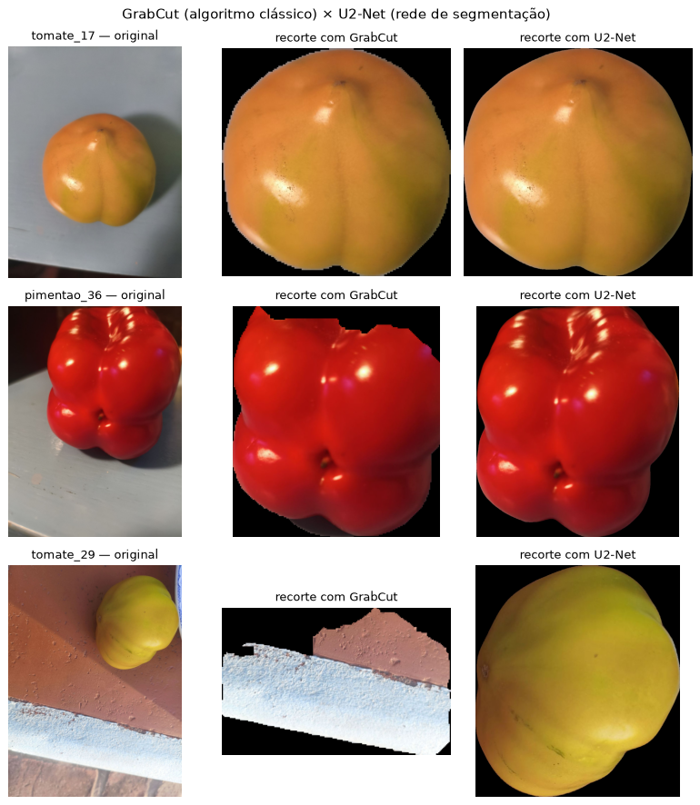

# Ir Além 2 — Transfer Learning × CNN do zero, com e sem segmentação

> **FIAP — Fase 6 · Escopo opcional 2** · Classificação de tomate e pimentão com uma rede pré-treinada com Fine Tuning (MobileNetV2) e com pré-segmentação por uma rede neural (U2-Net)

> ✅ **Situação:** notebook completo — executado no Google Colab com GPU, com as 4 combinações treinadas e avaliadas, a tabela comparativa (seção 7) e as conclusões (seção 8). Falta só a gravação do vídeo.

## 🎯 Objetivo

O enunciado pede, nas palavras dele:

> *"Aplicar uma rede de segmentação do objeto desejado, criando uma máscara; Usar a máscara obtida para 'cortar' a imagem original, deixando apenas o objeto principal e apagando o background [...] Realizar Fine Tuning, justificar a escolha da camada de congelamento."*

A Entrega 2 treinou uma **CNN do zero** para classificar a imagem inteira. Este escopo testa duas hipóteses, sobre as mesmas 80 imagens e a **mesma divisão** das Entregas 1 e 2 (32 treino / 4 validação / 4 teste por classe):

1. **Uma rede pré-treinada classifica melhor que uma treinada do zero?** Para isso, *Transfer Learning* com **Fine Tuning** da **MobileNetV2**, pré-treinada na ImageNet, em duas fases:
   - **fase 1:** só o classificador novo é treinado, com a rede base congelada;
   - **fase 2 (Fine Tuning):** as últimas 20 camadas da base são descongeladas e ajustadas com uma taxa de aprendizado 10 vezes menor.
2. **Separar o objeto do fundo antes de classificar ajuda?** Para isso, **segmentação com uma rede neural, a U2-Net** (biblioteca `rembg`). Ela cria a máscara do objeto principal da foto sem nenhuma rotulagem manual nova; a máscara apaga o fundo e recorta a imagem no objeto antes de ela entrar na rede de classificação.

## 🧪 Como a comparação foi feita

As duas hipóteses se cruzaram em 4 combinações, todas avaliadas nas mesmas 8 imagens de teste:

| | **Sem segmentação** | **Com segmentação (U2-Net)** |
|:--|:--:|:--:|
| **CNN do zero** | 7/8 — resultado da Entrega 2 (não é treinada de novo) | 6/8 — seção 4 do notebook |
| **Transfer Learning + Fine Tuning (MobileNetV2)** | 6/8 — seção 5 do notebook | 6/8 — seção 6 do notebook |

Para cada combinação, o notebook mediu:
- a **acurácia no teste**;
- o **tempo de treino** (no Transfer Learning, a soma das duas fases);
- o **tempo de inferência por imagem**. Nas versões com segmentação, esse tempo incluiu a U2-Net, porque ela faz parte do caminho até a resposta.

## 📊 Resultados

Execução no Google Colab com GPU, nas mesmas 8 imagens de teste (detalhes nas seções 4.2, 5.2 e 6.2 do notebook):

| Abordagem | Segmentação | Acurácia no teste | Tempo de treino | Inferência por imagem (mediana) |
|:--|:--:|:--:|:--:|:--:|
| CNN do zero (Entrega 2) | não | 7/8 | 10,8 s | — |
| CNN do zero | U2-Net | 6/8 | 13,2 s | 1.304,2 ms |
| MobileNetV2 + Fine Tuning | não | 6/8 | 32,4 s | 172,4 ms |
| MobileNetV2 + Fine Tuning | U2-Net | 6/8 | 28,6 s | 1.404,9 ms |

A linha da Entrega 2 vem de outra execução do Colab e serve de referência; as outras três foram medidas nesta execução. Nas versões com segmentação, a inferência inclui a U2-Net.

**Conclusão principal:** neste dataset pequeno (64 fotos de treino), **nenhuma das duas técnicas trouxe ganho de acurácia** sobre a CNN do zero da Entrega 2, a abordagem mais simples:

- **Hipótese 1 — a rede pré-treinada é melhor?** Não se confirmou: a MobileNetV2 com Fine Tuning acertou 6 de 8, contra 7 de 8 da CNN do zero.
- **Hipótese 2 — segmentar antes ajuda?** Também não: na CNN do zero, a acurácia foi de 7/8 (Entrega 2) para 6/8; no Transfer Learning, ficou igual (6/8), mas a inferência ficou cerca de **8 vezes mais lenta** (de 172,4 ms para 1.404,9 ms por imagem) por causa da U2-Net.
- Os erros se concentraram nas mesmas imagens — o `pimentao_23` errou em 3 das 4 combinações —, o que indica um caso difícil do dataset, e não uma falha de uma técnica específica.
- **Ressalva:** com só 8 imagens de teste, cada acerto vale 12,5 pontos percentuais; as diferenças são indicação, não prova.

A análise completa está na seção 8 do notebook.

## 🧠 Escolhas e justificativas

**CNN do zero com segmentação (seção 4):** é a **mesma CNN da Entrega 2** — mesmas camadas, hiperparâmetros e critério de parada (conferido camada a camada) —, só que recebendo as imagens pré-segmentadas pela U2-Net. A hipótese: com só 64 fotos de treino, uma rede que aprende do zero pode se apoiar no fundo (piso, parede, mesa) para separar as classes; apagando o fundo, a expectativa é que ela se concentre no fruto. O efeito contrário também era possível — o recorte muda a escala do fruto e tira o contexto —, e era isso que a comparação precisava medir. Neste dataset, a hipótese não se confirmou: com a segmentação, a CNN do zero acertou 6 de 8, contra 7 de 8 sem ela (ver [Resultados](#-resultados)).

**MobileNetV2:** é leve (cerca de 2,26 milhões de parâmetros na parte convolucional), tem pesos da ImageNet prontos no Keras e aceita entrada de 128×128, o mesmo tamanho da CNN da Entrega 2. Isso mantém a comparação justa.

**Camada de congelamento (Fine Tuning a partir do `block_15_expand`):**
- **As camadas iniciais ficam congeladas.** Elas aprendem características genéricas, como bordas, cores e texturas, que servem para qualquer foto, inclusive de tomate e pimentão. Por isso os pesos da ImageNet são reaproveitados como estão.
- **As últimas 20 camadas são ajustadas.** São os blocos 15 e 16 e a convolução final `Conv_1`. Elas combinam aquelas características em padrões específicos das classes da ImageNet, então são as que precisam se adaptar ao nosso domínio (formato, brilho e cor dos frutos).
- **Por que não descongelar mais:** com só 64 fotos de treino, descongelar muitos pesos aumenta o risco de a rede decorar o treino. Descongelando a partir do `block_15_expand` ficam treináveis cerca de 1,2 milhão de pesos; a partir do `block_14_expand` (29 camadas) seriam 1,5 milhão, e a partir do `block_13_expand` (38 camadas), 1,7 milhão.
- **Taxa de aprendizado na fase 2:** 1e-4, 10 vezes menor que na fase 1. A ideia é ajustar os pesos da ImageNet aos poucos, sem apagar o que a rede já sabe.
- **BatchNormalization:** essas camadas seguem em modo de inferência no Fine Tuning. Com lotes de só 8 fotos, recalcular as médias delas desorganizaria o que foi aprendido.
- **Salvaguarda:** se o Fine Tuning não alcançar a acurácia de validação da fase 1, o modelo volta para os pesos da fase 1. O resumo do treino informa qual dos dois foi usado.

**U2-Net:** é uma rede neural de segmentação de objeto saliente, já pré-treinada para separar o objeto principal de uma foto do fundo. Esse é exatamente o caso do nosso dataset: um fruto por foto, fotografado de perto. Ela funciona sem prompt e sem máscaras desenhadas à mão.

## 🔍 Por que a segmentação mudou: GrabCut × U2-Net

A primeira versão deste notebook usava **GrabCut** (OpenCV), um algoritmo clássico de separação de objeto e fundo. Ele foi trocado pela **U2-Net** por dois motivos:
- o enunciado pede uma **rede** de segmentação;
- num teste com as 8 imagens de teste, executado fora do Colab, a U2-Net foi bem melhor.

| Imagem | GrabCut | U2-Net |
|:--|:--|:--|
| tomate_23 | levou junto parte do piso | só o tomate |
| **tomate_29** | pegou **a parede** no lugar do tomate | **o tomate** |
| pimentao_12 | levou junto a parede ao lado | só o pimentão |
| pimentao_36 | cortou o topo do pimentão | o pimentão inteiro |
| demais 4 imagens | objeto certo | objeto certo (máscaras quase iguais) |

Resultado: a **U2-Net acertou o objeto nas 8 imagens**, contra 5 do GrabCut. O custo foi de cerca de 0,5 s por imagem em CPU.



## ✅ Verificações feitas antes da execução oficial (fora do Colab)

- **Carregamento do dataset:** a versão sem segmentação é **idêntica, pixel a pixel**, à entrada que a CNN da Entrega 2 recebeu.
- **Segmentação:** a U2-Net rodou nas 80 imagens, sem nenhuma falha de máscara. O teste visual da seção 3.1 está na figura acima.
- **Código dos treinos (seções 4, 5 e 6):** antes da execução oficial, o notebook inteiro foi executado com **1 época**, só para provar que roda de ponta a ponta, sem nenhum erro. No Transfer Learning, os pesos treináveis bateram com o planejado: 1.281 na fase 1 (só o classificador) e 1.207.361 na fase 2 — os mesmos números da execução oficial no Colab.

## ▶️ Como Executar

O notebook roda no **Google Colab**, um serviço do Google que executa o código no navegador, sem instalar nada no computador. Os passos são os mesmos dos notebooks das Entregas 1 e 2.

**O que você precisa:**
- uma **conta Google** com acesso à pasta `FarmTech_Fase6` no Google Drive (compartilhada com o grupo);
- um **navegador**.

**Passo 1 — Criar o atalho da pasta do projeto no seu Google Drive (só na primeira vez).**

1. Abra [drive.google.com](https://drive.google.com) e clique em **Compartilhados comigo**.
2. Clique com o botão direito em **`FarmTech_Fase6`** → **Organizar** → **Adicionar atalho** → **Meu Drive** → **Adicionar**.

**Deu certo se:** em **Meu Drive** aparece `FarmTech_Fase6` com uma pequena seta no ícone. Quem é dono da pasta já a vê ali e pode pular este passo.

**Passo 2 — Abrir o notebook no Colab, direto do GitHub.**

1. Abra [colab.research.google.com](https://colab.research.google.com). Se aparecer a janela "Abrir notebook", use-a; se não, clique em **Arquivo → Abrir notebook**.
2. Clique na aba **GitHub**, digite `Graca-Gerson/grupo-3-farmtech-fase6` e aperte **Enter**.
3. Na lista, clique em **`ir_alem/ir_alem_2_transfer_learning/GersonFerreiraDaGraca_rm569624_pbl_fase6_ir_alem_2.ipynb`**.

**Deu certo se:** o notebook abre com o título "Ir Além 2 — Transfer Learning × CNN do zero, com e sem segmentação".

**Passo 3 — Ligar a GPU.** Menu **Ambiente de execução → Alterar tipo de ambiente de execução** → escolha **GPU T4** → **Salvar**.

**Passo 4 — Colocar o seu nome.** Na **primeira célula de código** (a que começa com `# Conectar ao Google Drive`), troque `EXECUTOR = 'gerson'` pelo seu primeiro nome, em minúsculas e sem acento (por exemplo, `EXECUTOR = 'ryann'`). Os resultados vão para `Resultados/ir_alem_2_<seu nome>/` no Drive.

**Passo 5 — Executar tudo.** Menu **Ambiente de execução → Executar tudo**. Na primeira célula, aceite o pedido de acesso ao Google Drive (**Conectar ao Google Drive** → escolha a conta → **Permitir**).

**O que deve aparecer:**

| Célula | Resultado esperado |
|--------|--------------------|
| Primeira (Drive) | `Mounted at /content/drive` |
| Segunda (instalação e ambiente) | `GPU disponível: True`. Se aparecer `False`, refaça o passo 3. Se o Colab mostrar um aviso pedindo para **reiniciar a sessão** (por causa da instalação do `rembg`), clique em **Reiniciar sessão** e execute tudo de novo |
| 2.0 (dataset) | `treino: 64`, `validacao: 8`, `teste: 8` e `✅ Dataset conferido` |
| 3.0 (U2-Net) | Na primeira vez, o download do modelo da U2-Net (cerca de 176 MB) |
| 3.1 (teste visual) | Uma figura com 3 linhas: original, máscara e imagem recortada |
| 3.2 (segmentação de todas) | O tempo total da U2-Net nas 80 imagens |
| 4.1 (CNN do zero com segmentação) | As épocas do treino e, ao final, uma linha começando com `Treino:` com o tempo, as épocas rodadas e a melhor época |
| 5.1 e 6.1 (Transfer Learning) | As épocas da fase 1 e da fase 2 e, ao final, um resumo com o tempo de treino e o modelo final usado |
| 4.2, 5.2 e 6.2 (teste) | Uma tabela com a resposta para cada uma das 8 imagens de teste e a acurácia |

**Passo 6 — Não salvar o notebook de volta no GitHub.** Se o Colab perguntar sobre salvar alterações ao fechar, **descarte**. Não use **Arquivo → Salvar uma cópia no GitHub**.

**Se algo der errado:**

| O que aparece | O que significa | O que fazer |
|---------------|-----------------|-------------|
| `FileNotFoundError` com `/content/drive/MyDrive/FarmTech_Fase6` | O Colab não achou a pasta do projeto | Faça o passo 1 e execute tudo de novo |
| `RuntimeError: Problemas no dataset` | Faltam fotos nas pastas do Drive | Leia a lista na mensagem e confira as pastas em [`docs/estrutura_drive.md`](../../docs/estrutura_drive.md) |
| `GPU disponível: False` | Sem GPU | Refaça o passo 3 e execute tudo de novo |
| `ModuleNotFoundError: No module named 'rembg'` | A célula de instalação não rodou | Use **Executar tudo** em vez de rodar células soltas |

## 📁 Arquivos

```
ir_alem/ir_alem_2_transfer_learning/
├── README.md                                                ← este arquivo
├── GersonFerreiraDaGraca_rm569624_pbl_fase6_ir_alem_2.ipynb   ← notebook
└── imagens/
    └── grabcut_x_u2net.png                                  ← comparação da segmentação nas 3 imagens de exemplo
```

No Drive, cada execução grava em `Resultados/ir_alem_2_<executor>/`:
- a figura `u2net_exemplos.png`;
- os modelos `cnn_do_zero_com_segmentacao.keras`, `mobilenetv2_sem_segmentacao.keras` e `mobilenetv2_com_segmentacao.keras`;
- o histórico de treino de cada modelo, em CSV.
